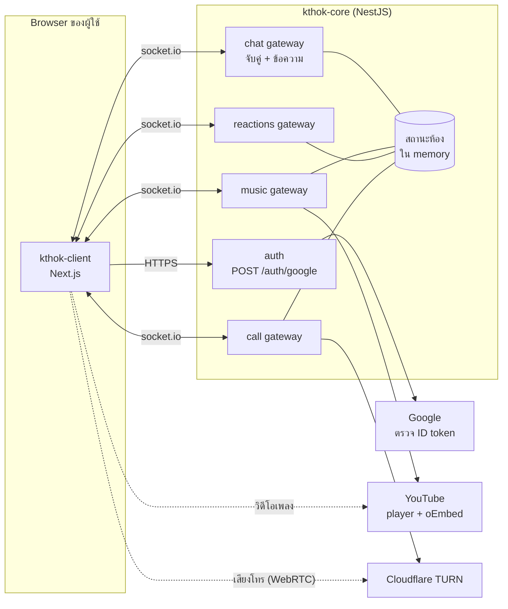
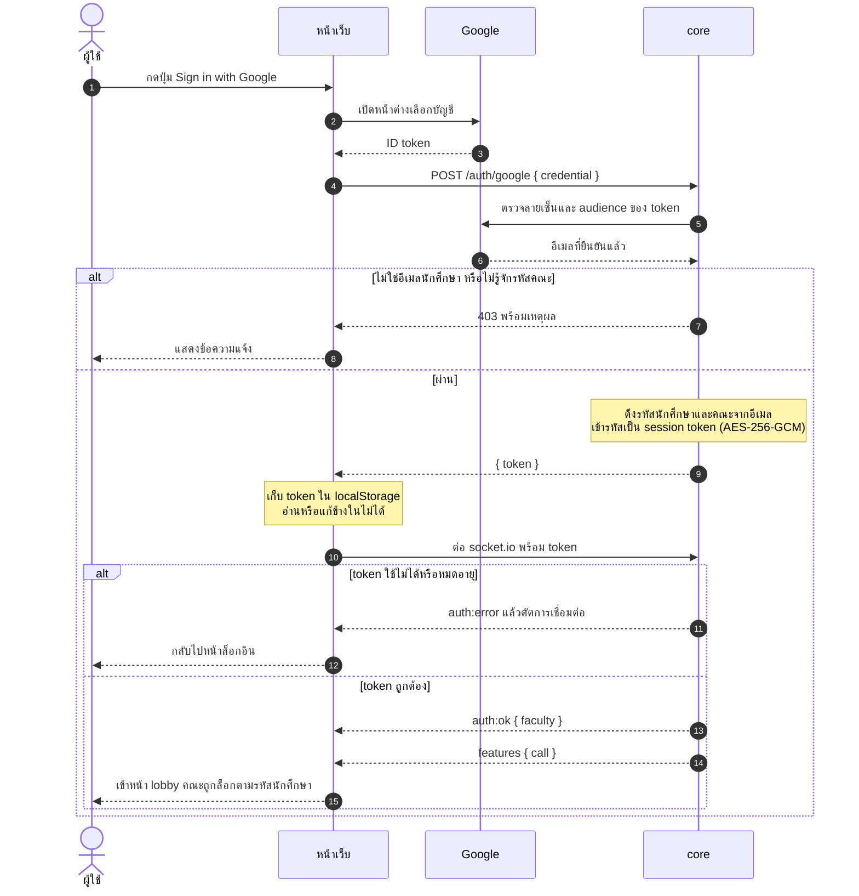
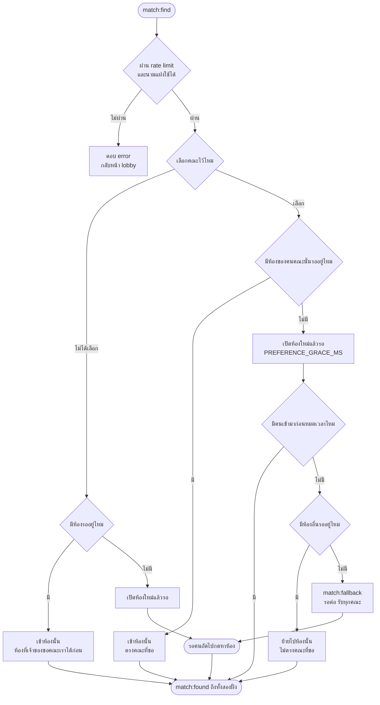
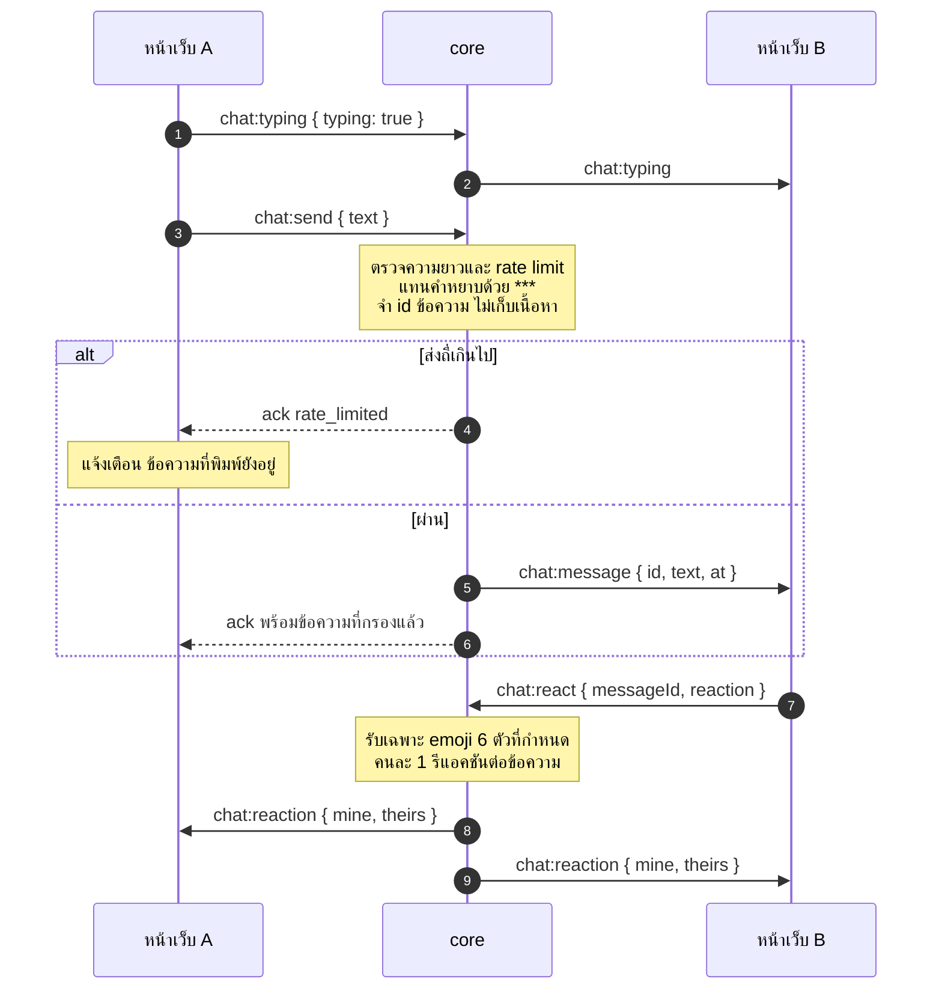
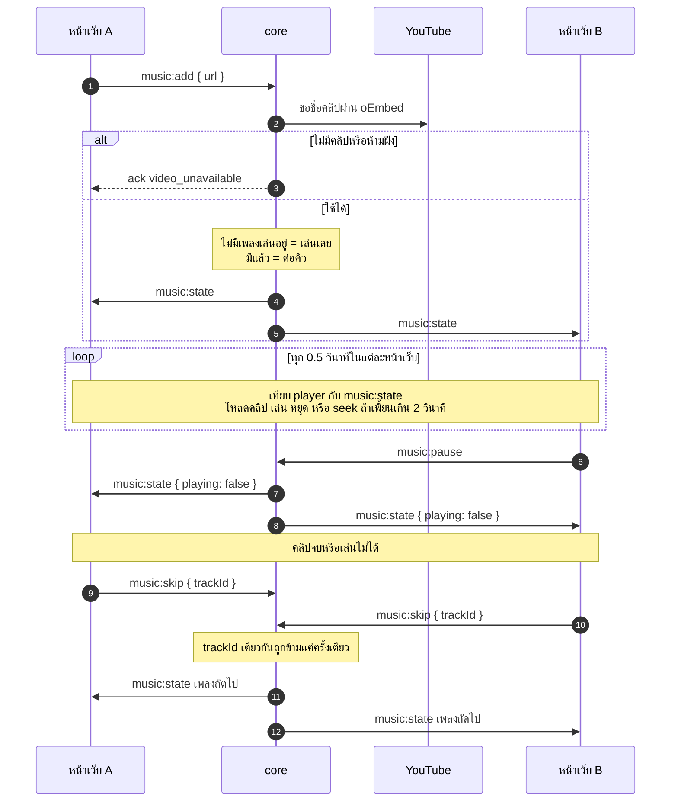
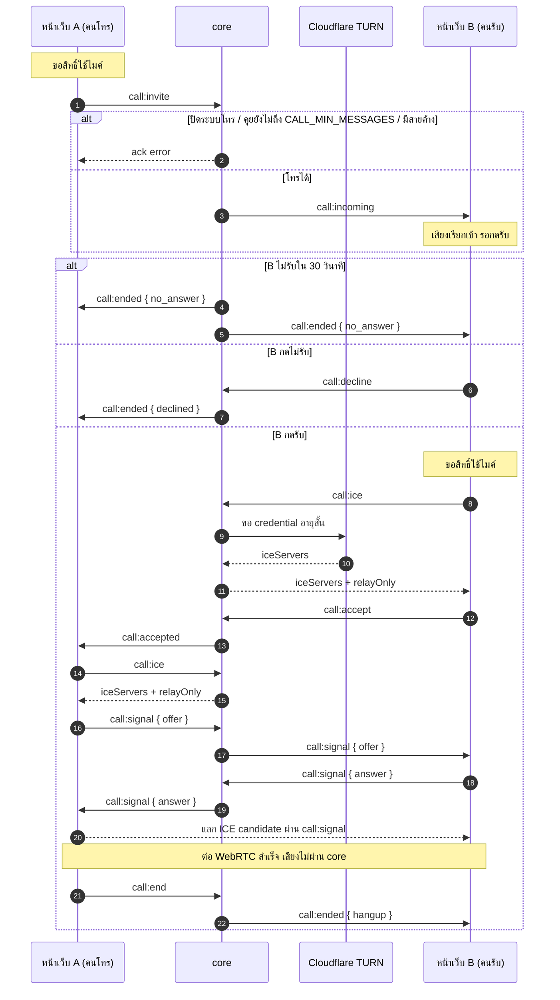
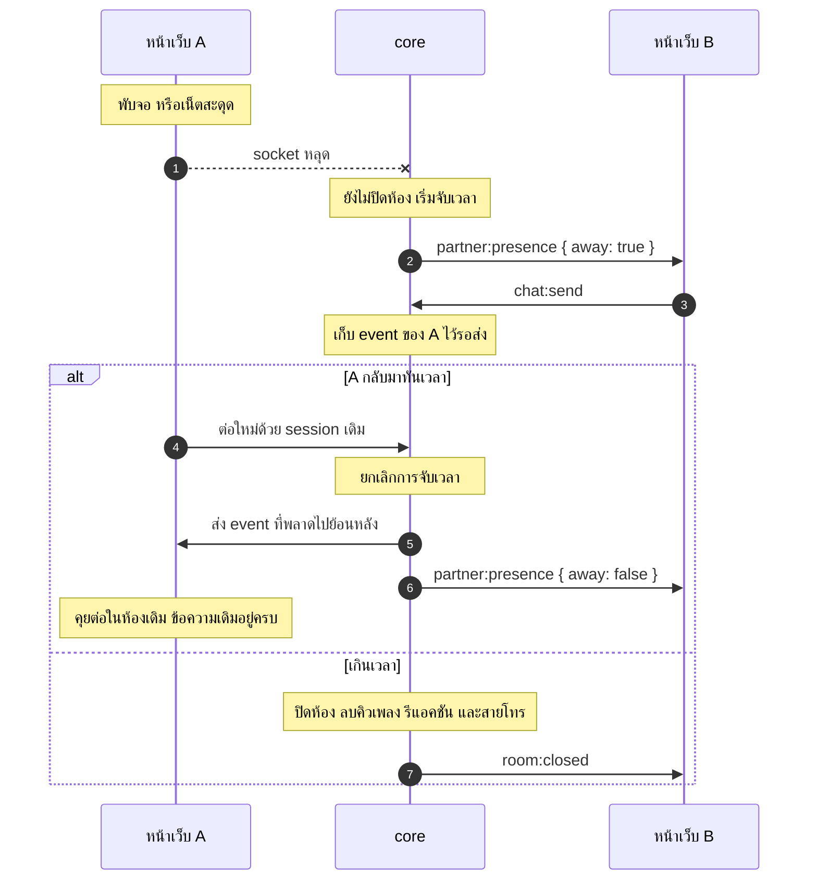
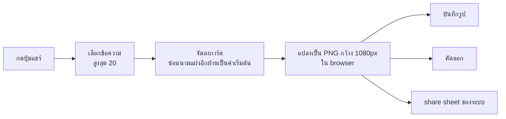

<p align="center">
  
</p>

<h1 align="center">K-Thok — client</h1>

<p align="center">แชตนิรนามสำหรับชาว สจล. กดแล้วจับคู่ให้เลย</p>

**K-Thok** ย่อมาจาก *KMITL Thok* (thok = talk) เป็นเว็บแชตนิรนามสำหรับนักศึกษา สจล.
อารมณ์คล้ายแอพหาเพื่อน แต่ **ไม่มีการปัดหรือรอ match** — กดหาห้องแล้วระบบจับคู่ให้ทันที
ถ้ายังไม่มีห้องว่างก็เปิดห้องใหม่รอ ถ้ามีห้องรออยู่ก็เข้าไปคุยเลย

repo นี้คือฝั่งหน้าเว็บ (Next.js) ใช้คู่กับ [kthok-core](https://github.com/ITKMTIL/kthok-core) ซึ่งเป็น server จับคู่และส่งข้อความ

## แรงบันดาลใจ

ได้ไอเดียและแนวทางหน้าตามาจาก [Drinks On Me](https://drinksonme.live/) — บาร์ทิพย์สำหรับคุยกับคนแปลกหน้า
สิ่งที่หยิบมาคือ concept "เข้ามาแล้วได้คุยเลย" และสไตล์ลายเส้น doodle (พื้นกระดาษ เส้นหมึกหนา ฟอนต์ลายมือ)
โค้ด รูป และข้อความทั้งหมดในโปรเจกต์นี้เขียนขึ้นใหม่ ไม่ได้นำ asset ของ Drinks On Me มาใช้
และโปรเจกต์นี้ไม่มีส่วนเกี่ยวข้องกับทีมงาน Drinks On Me

## ฟีเจอร์หลัก

- **จับคู่ทันที** — กด "หาเพื่อนคุย" แล้วเข้าห้อง 1 ต่อ 1 กับคนที่รออยู่ หรือเปิดห้องรอ
- **เลือกคณะที่อยากคุยด้วย** — ถ้าไม่มีคนจากคณะนั้นรออยู่ ระบบรอให้ครู่หนึ่งแล้วพาไปห้องที่ว่างแทน
- **ล็อกอินด้วยอีเมลนักศึกษา** (`@kmitl.ac.th` ผ่าน Google) — ใช้ยืนยันว่าเป็นเด็ก สจล. และดึงคณะจากรหัสนักศึกษา อีกฝ่ายเห็นแค่นามแฝงกับคณะ
- **นามแฝง** — ตั้งเองหรือกดสุ่ม
- **แชต realtime** — สถานะกำลังพิมพ์, รีแอคชัน emoji บนข้อความ, กรองคำหยาบ
- **ฟังเพลงด้วยกัน** — วางลิงก์ YouTube เข้าคิว เล่น/หยุด/ข้ามพร้อมกันทั้งสองฝั่ง
- **โทรคุยเสียง** — WebRTC ต้องให้อีกฝ่ายกดรับก่อน เปิด/ปิดได้จากฝั่ง server
- **แชร์บทสนทนาเป็นรูป** — เลือกข้อความแล้วสร้างการ์ด PNG ในเครื่องผู้ใช้เอง
- **เสียงแจ้งเตือน** และตัวเลขข้อความใหม่บนชื่อ tab
- **หลุดแล้วกลับห้องเดิมได้** — พับจอหรือเน็ตสะดุดช่วงสั้น ๆ ไม่ทำให้ห้องหาย
- **ใช้บนมือถือได้** — แผงเพลงหุบได้ และ layout ไม่โดนแป้นพิมพ์บัง

### ความเป็นส่วนตัว

- ไม่มีฐานข้อมูล ข้อความไม่ถูกบันทึกที่ server ออกจากห้องแล้วหายเลย
- อีเมลและรหัสนักศึกษาใช้แค่ตอนยืนยันตัวตน ไม่ถูกเก็บ
- รูปที่แชร์สร้างใน browser ไม่ถูกอัปโหลด

## เทคโนโลยี

Next.js 16 (App Router) · React 19 · TypeScript · Tailwind CSS 4 · socket.io-client · lucide-react · html-to-image

## เริ่มใช้งาน

ต้องมี Node.js 20 ขึ้นไป และ [pnpm](https://pnpm.io/) และต้องรัน [kthok-core](https://github.com/ITKMTIL/kthok-core) ไว้ก่อน

```bash
pnpm install
cp .env.example .env
pnpm dev
```

เปิด http://localhost:3000

### ตัวแปรใน `.env`

| ตัวแปร | ความหมาย |
| --- | --- |
| `NEXT_PUBLIC_CORE_URL` | URL ของ kthok-core (ค่าเริ่มต้น `http://localhost:3001`) |
| `NEXT_PUBLIC_GOOGLE_CLIENT_ID` | OAuth Client ID ของ Google เว้นว่าง = โหมดทดลอง ไม่ต้องล็อกอินและเลือกคณะเองได้ |
| `NEXT_PUBLIC_SITE_URL` | URL จริงของเว็บ ใช้สร้างลิงก์รูป preview ตอนแชร์ลิงก์ |

ถ้าเปิดล็อกอิน ค่า `NEXT_PUBLIC_GOOGLE_CLIENT_ID` ต้องตรงกับ `GOOGLE_CLIENT_ID` ของ kthok-core
และต้องเพิ่ม origin ของเว็บใน *Authorized JavaScript origins* ของ OAuth client (ไม่ต้องตั้ง redirect URI)

### คำสั่ง

| คำสั่ง | ทำอะไร |
| --- | --- |
| `pnpm dev` | รัน dev server |
| `pnpm build` / `pnpm start` | build และรันแบบ production |
| `pnpm lint` | ตรวจโค้ดด้วย ESLint |

## โครงสร้างโปรเจกต์

```
app/          หน้าเว็บ, metadata, icon และรูป preview
components/   UI แยกตามฟีเจอร์: app, auth, lobby, chat, music, call, share, ui
hooks/        state และ logic เช่น use-chat, use-voice-call, use-youtube-player
lib/          ตัวช่วย: reducer ของแชต, เสียง, สร้างรูป, storage, config
constants/    รายชื่อคณะ, ข้อความแจ้งเตือน, รีแอคชัน
types/        type ที่ใช้ร่วมกัน
```

## ทำงานอย่างไร (คร่าว ๆ)

1. หน้าเว็บต่อ socket.io ไปที่ core พร้อม session token (ถ้าเปิดล็อกอิน)
2. กดหาห้อง → core จับคู่ แล้วส่ง event กลับมาบอกว่าได้คู่กับใคร
3. ข้อความ รีแอคชัน สถานะเพลง และสัญญาณโทร ส่งผ่าน socket เดียวกัน โดย core เป็นคนกลาง
4. เสียงของการโทรวิ่งผ่าน WebRTC ไม่ผ่าน core
5. state ทั้งหมดของห้องอยู่ใน `hooks/use-chat.ts` และ `lib/chat-reducer.ts`

รายละเอียดฝั่ง server และรายการ event ดูที่ README ของ [kthok-core](https://github.com/ITKMTIL/kthok-core)

## Flow การทำงานของแต่ละฟีเจอร์

ชื่อ event ในแผนภาพตรงกับที่ใช้ในโค้ดจริง ผู้ใช้สองคนในห้องเรียกว่า A และ B กดที่หัวข้อเพื่อเปิดดูแผนภาพ

### ภาพรวมระบบ



gateway ทั้งหมดใช้ socket เส้นเดียวกัน ไม่มีฐานข้อมูลเก็บข้อความ

<details>
<summary><b>1. ล็อกอินด้วยอีเมลนักศึกษา</b></summary>

ทำงานเมื่อ core ตั้ง `GOOGLE_CLIENT_ID` ไว้ ถ้าไม่ตั้งจะเป็นโหมดทดลองที่ข้ามขั้นตอนนี้



</details>

<details>
<summary><b>2. จับคู่และเลือกคณะ</b></summary>

ผู้ใช้กด "หาเพื่อนคุย" หน้าเว็บส่ง `match:find` พร้อมนามแฝงและคณะที่อยากคุยด้วย (ถ้ามี)



</details>

<details>
<summary><b>3. แชตและรีแอคชัน</b></summary>



</details>

<details>
<summary><b>4. ฟังเพลงด้วยกัน</b></summary>

core เป็นผู้ถือสถานะเพลงของห้อง หน้าเว็บทั้งสองฝั่งปรับ player ให้ตรงกับสถานะนั้น



</details>

<details>
<summary><b>5. โทรคุยเสียง</b></summary>

core ส่งต่อเฉพาะสัญญาณ ตัวเสียงวิ่งผ่าน WebRTC ระหว่างสองเครื่อง หรือผ่าน TURN เมื่อบังคับ relay



</details>

<details>
<summary><b>6. หลุดแล้วกลับห้องเดิม</b></summary>

ใช้ connection state recovery ของ socket.io ห้องถูกเก็บไว้ `RECONNECT_GRACE_MS` หลัง socket หลุด



กด "ออก" หรือปิดหน้าเว็บจะส่ง `room:leave` และปิดห้องทันทีโดยไม่รอ

</details>

<details>
<summary><b>7. แชร์บทสนทนาเป็นรูป</b></summary>

ทำงานในหน้าเว็บทั้งหมด ไม่มีการส่งข้อมูลไป core



</details>

---

โปรเจกต์นี้พัฒนาโดยมี AI ช่วยเขียนโค้ด ([Claude Code](https://claude.com/claude-code)) ภายใต้การกำกับและตรวจทานของทีมผู้พัฒนา
